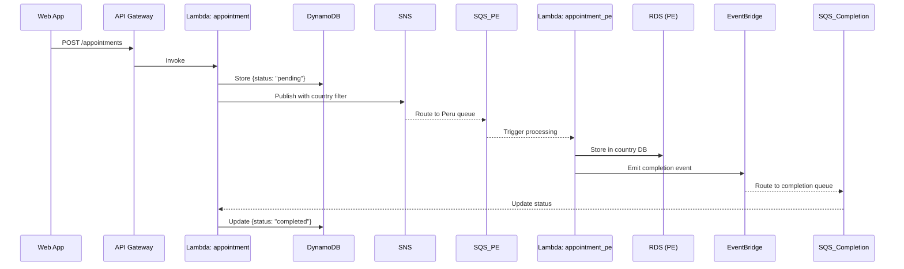

# 🏥 Medical Appointments API - Serverless Backend

[](https://github.com/mmartinrm97/serverless-medical-appointment-system)
[](https://www.typescriptlang.org/)
[](https://www.serverless.com/)
[](https://nodejs.org/)
[](https://aws.amazon.com/)

Serverless backend application for managing medical appointments across Peru (PE) and Chile (CL). Built with Clean Architecture principles, SOLID design patterns, and comprehensive testing.

## 📋 Table of Contents

- [🎯 Overview](#-overview)
- [🏗️ Architecture](#️-architecture)
- [🚀 Quick Start](#-quick-start)
- [📡 API Endpoints](#-api-endpoints)
- [🛠️ Development](#️-development)
- [🧪 Testing](#-testing)
- [📚 Documentation](#-documentation)
- [🚀 Deployment](#-deployment)
- [🔧 Configuration](#-configuration)
- [📊 Monitoring](#-monitoring)

## 🎯 Overview

This serverless backend implements a medical appointment scheduling system that:

- **Receives appointment requests** via REST API
- **Processes appointments asynchronously** by country (PE/CL)
- **Stores data** in DynamoDB (fast access) and RDS MySQL (country-specific)
- **Uses event-driven architecture** with SNS, SQS, and EventBridge
- **Provides real-time status tracking** for appointment processing

### Business Flow



## 🏗️ Architecture

### Tech Stack

- **Framework**: Serverless Framework 4.x with TypeScript
- **Runtime**: Node.js 20.x
- **Cloud Provider**: AWS
- **Database**: DynamoDB + RDS MySQL
- **Messaging**: SNS, SQS, EventBridge
- **Testing**: Vitest with 136 tests (100% passing)
- **Code Quality**: ESLint, Prettier, TypeScript strict mode

### Clean Architecture Layers

```
src/
├── modules/appointments/
│   ├── domain/           # Business entities & rules
│   ├── application/      # Use cases & services
│   ├── infrastructure/   # External adapters
│   └── interfaces/       # Controllers & handlers
└── shared/              # Cross-cutting concerns
```

### AWS Resources

| Service         | Resource                    | Purpose                       |
| --------------- | --------------------------- | ----------------------------- |
| **API Gateway** | `/appointments`             | REST API endpoints            |
| **Lambda**      | `appointment`               | Main API + completion handler |
| **Lambda**      | `appointment_pe`            | Peru-specific processing      |
| **Lambda**      | `appointment_cl`            | Chile-specific processing     |
| **DynamoDB**    | `appointments`              | Fast appointment storage      |
| **RDS MySQL**   | PE/CL databases             | Country-specific storage      |
| **SNS**         | `appointment-notifications` | Message routing               |
| **SQS**         | 3 queues + 3 DLQs           | Async processing              |
| **EventBridge** | Default bus                 | Event routing                 |

## 🚀 Quick Start

### Prerequisites

- Node.js 20.x
- pnpm (recommended) or npm
- AWS CLI configured
- Docker (for local development)

### Installation

```bash
# Clone the repository
git clone https://github.com/mmartinrm97/serverless-medical-appointment-system.git
cd serverless-medical-appointment-system/medical-appointments-api

# Install dependencies
pnpm install

# Start local development environment
pnpm run local:start
```

### Verify Installation

```bash
# Run tests
pnpm run test

# Check API is running
curl http://localhost:3000/appointments/12345
```

## 📡 API Endpoints

### Base URL

- **Local**: `http://localhost:3000`
- **Production**: `https://your-api-gateway-url.amazonaws.com`

### Endpoints

#### 🔸 Create Appointment

```http
POST /appointments
Content-Type: application/json

{
  "insuredId": "12345",      # 5-digit insured code
  "scheduleId": 100,         # Appointment slot ID
  "countryISO": "PE"         # "PE" or "CL"
}
```

**Response:**

```json
{
  "appointmentId": "01J7N123ABCDEFGHIJKLMNPQRS",
  "insuredId": "12345",
  "scheduleId": 100,
  "countryISO": "PE",
  "status": "pending",
  "createdAt": "2024-09-11T10:30:00.000Z",
  "updatedAt": "2024-09-11T10:30:00.000Z"
}
```

#### 🔸 Get Appointments

```http
GET /appointments/{insuredId}?status=pending&limit=10&lastKey=xyz
```

**Response:**

```json
{
  "appointments": [
    {
      "appointmentId": "01J7N123ABCDEFGHIJKLMNPQRS",
      "scheduleId": 100,
      "countryISO": "PE",
      "status": "completed",
      "createdAt": "2024-09-11T10:30:00.000Z",
      "updatedAt": "2024-09-11T15:45:00.000Z"
    }
  ],
  "pagination": {
    "total": 1,
    "limit": 50,
    "hasMore": false,
    "lastKey": null
  }
}
```

### Status Codes

| Code  | Status         | Description                         |
| ----- | -------------- | ----------------------------------- |
| `200` | OK             | Appointments retrieved successfully |
| `201` | Created        | Appointment created successfully    |
| `400` | Bad Request    | Invalid input data                  |
| `404` | Not Found      | No appointments found               |
| `500` | Internal Error | Server error                        |

## 🛠️ Development

### Local Development Setup

Our local development environment uses **LocalStack** + **Docker** to simulate AWS services:

```bash
# Start all local services (LocalStack + MySQL)
pnpm run local:start

# In another terminal, start the API
pnpm run dev

# Setup LocalStack resources (first time only)
pnpm run local:setup
```

### Available Scripts

```bash
# Development
pnpm run dev              # Start serverless offline
pnpm run local:start      # Start LocalStack + MySQL
pnpm run local:stop       # Stop local services

# Building
pnpm run build            # Compile TypeScript
pnpm run build:clean      # Clean build

# Testing
pnpm run test             # Run all tests
pnpm run test:unit        # Unit tests only
pnpm run test:e2e         # End-to-end tests
pnpm run test:coverage    # Coverage report
pnpm run test:watch       # Watch mode

# Code Quality
pnpm run lint             # ESLint check
pnpm run lint:fix         # Fix ESLint issues
pnpm run format           # Prettier formatting
pnpm run typecheck        # TypeScript check

# Documentation
pnpm run docs:generate    # Generate OpenAPI YAML
pnpm run docs:postman     # Generate Postman collection
```

### Environment Variables

```bash
# Core settings
STAGE=dev
NODE_ENV=development
AWS_REGION=us-east-1

# LocalStack
AWS_ENDPOINT_URL=http://localhost:4566
AWS_ACCESS_KEY_ID=test
AWS_SECRET_ACCESS_KEY=test

# Database connections
DB_HOST_PE=localhost
DB_PORT_PE=3307
DB_NAME_PE=appointments_pe

DB_HOST_CL=localhost
DB_PORT_CL=3308
DB_NAME_CL=appointments_cl
```

## 🧪 Testing

### Test Suite Overview

- **136 tests** across all layers
- **100% passing** rate
- **Coverage**: >80% threshold
- **Types**: Unit, Integration, E2E

### Test Structure

```bash
__tests__/
├── modules/appointments/
│   ├── domain/              # 44 tests - Entities & Events
│   ├── application/         # 6 tests - Use Cases
│   ├── infrastructure/      # 41 tests - Repositories & Messaging
│   └── interfaces/          # 45 tests - HTTP & Queue handlers
└── shared/                  # Utilities & fixtures
```

### Running Tests

```bash
# Quick test run
pnpm test

# Watch mode for development
pnpm run test:watch

# Coverage report
pnpm run test:coverage

# E2E tests with real LocalStack
pnpm run test:e2e
```

### Test Categories

#### Unit Tests (91 tests)

- Domain entities validation
- Use case business logic
- Repository implementations
- Message handlers

#### Integration Tests (35 tests)

- API endpoint flows
- Database operations
- Message queue processing
- Event publishing

#### E2E Tests (10 tests)

- Complete appointment lifecycle
- Cross-service integration
- Error handling scenarios

## 📚 Documentation

### OpenAPI Documentation

We provide comprehensive API documentation:

```bash
# Generate OpenAPI documentation
pnpm run docs:generate     # Creates docs/api/openapi.yml
pnpm run docs:postman      # Creates Postman collection
```

**Generated Files:**

- `docs/api/openapi.yml` - OpenAPI 3.0.4 specification
- `docs/api/openapi.json` - JSON format
- `docs/api/postman-collection.json` - Postman collection

### Architecture Documentation

- **[Technical Challenge](docs/instructions/technical-challenge.md)** - Original requirements
- **[Development Instructions](docs/instructions/instructions.md)** - Setup guide
- **[Project Checklist](docs/instructions/checklist.md)** - Development progress

### Code Documentation

```bash
# Generate TypeDoc documentation
npx typedoc src/
```

## 🚀 Deployment

### Deployment Stages

| Stage  | Environment | Purpose               |
| ------ | ----------- | --------------------- |
| `dev`  | Development | Testing & development |
| `qa`   | Staging     | Integration testing   |
| `prod` | Production  | Live environment      |

### Deploy Commands

```bash
# Deploy to development
pnpm run deploy:dev

# Deploy to production
pnpm run deploy:prod

# Custom stage
serverless deploy --stage qa
```

### Pre-deployment Checklist

- [ ] All tests passing (`pnpm test`)
- [ ] TypeScript compilation successful (`pnpm run build`)
- [ ] Linting checks passed (`pnpm run lint`)
- [ ] Environment variables configured
- [ ] RDS databases provisioned
- [ ] VPC configuration set

### Post-deployment Verification

```bash
# Test deployed API
curl https://your-api-id.execute-api.region.amazonaws.com/appointments/12345

# Check CloudWatch logs
serverless logs -f appointment --tail
```

## 🔧 Configuration

### AWS Services Configuration

#### DynamoDB Table

```yaml
TableName: medical-appointments-api-appointments-${self:provider.stage}
KeySchema:
  - AttributeName: PK # insuredId
  - AttributeName: SK # appointmentId (ULID)
```

#### SNS Topic & SQS Queues

```yaml
SNS Topic: appointment-notifications
SQS Queues:
  - appointment-pe-queue (+ DLQ)
  - appointment-cl-queue (+ DLQ)
  - appointment-completion-queue (+ DLQ)
```

#### RDS Configuration

```yaml
Peru Database:
  - Host: Configured via SSM Parameter
  - Credentials: AWS Secrets Manager

Chile Database:
  - Host: Configured via SSM Parameter
  - Credentials: AWS Secrets Manager
```

### Security Configuration

- **IAM Roles**: Principle of least privilege
- **VPC**: Lambda functions in private subnets for RDS access
- **Secrets Manager**: Database credentials encryption
- **Input Validation**: Zod schemas for all endpoints

## 📊 Monitoring

### CloudWatch Metrics

Key metrics monitored:

- API Gateway request count & latency
- Lambda invocation count & duration
- DynamoDB read/write capacity
- SQS message count & age
- RDS connection count

### Logging

Structured logging with Pino:

```json
{
  "level": "info",
  "time": "2024-09-11T10:30:00.000Z",
  "msg": "Appointment created",
  "appointmentId": "01J7N123...",
  "insuredId": "12345",
  "countryISO": "PE"
}
```

### Error Handling

- **Dead Letter Queues**: For failed message processing
- **Retry Logic**: Exponential backoff for transient failures
- **Circuit Breaker**: Database connection protection
- **Graceful Degradation**: Fallback mechanisms

## 🤝 Contributing

### Development Workflow

1. **Fork** the repository
2. **Create** feature branch (`git checkout -b feature/amazing-feature`)
3. **Write** tests for your changes
4. **Ensure** all tests pass (`pnpm test`)
5. **Commit** changes (`git commit -m 'Add amazing feature'`)
6. **Push** to branch (`git push origin feature/amazing-feature`)
7. **Open** Pull Request

### Code Standards

- **TypeScript**: Strict mode enabled
- **ESLint**: Airbnb configuration
- **Prettier**: Code formatting
- **Conventional Commits**: Commit message format
- **Test Coverage**: >80% threshold

## 📜 License

This project is licensed under the MIT License - see the [LICENSE](LICENSE) file for details.

## 👥 Authors

- **Miguel Martin** - _Initial work_ - [@mmartinrm97](https://github.com/mmartinrm97)

## 🙏 Acknowledgments

- Clean Architecture principles by Robert C. Martin
- Serverless Framework community
- AWS documentation and best practices

---

## 📞 Support

- **Repository**: [https://github.com/mmartinrm97/serverless-medical-appointment-system](https://github.com/mmartinrm97/serverless-medical-appointment-system)
- **Issues**: [GitHub Issues](https://github.com/mmartinrm97/serverless-medical-appointment-system/issues)
- **Documentation**: [OpenAPI Spec](docs/api/openapi.yml)

---

_Built with ❤️ using Serverless Framework, TypeScript, and AWS_
